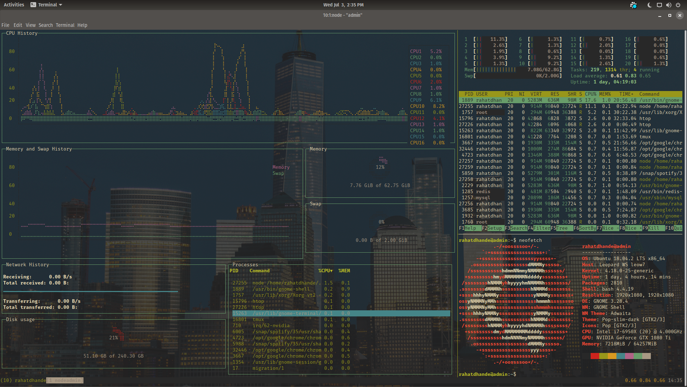
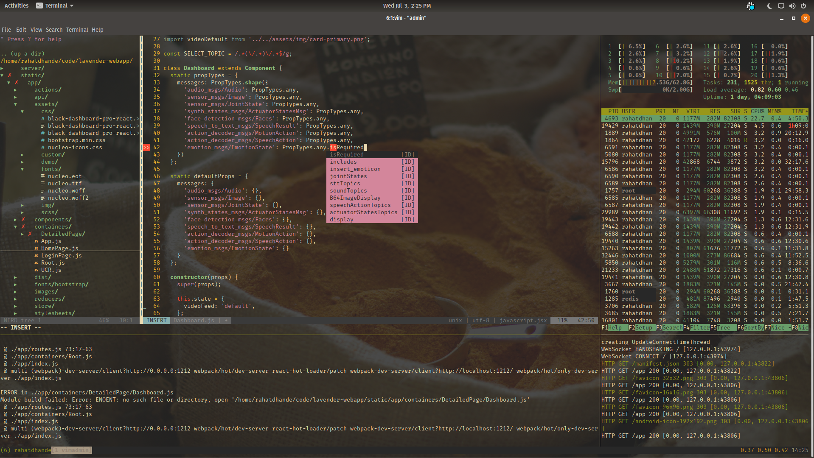

gruvcube
========
> a minimal but flashy tmux.vim desktop/IDE `.dotfile` conf

Philosophy
---------

### Minimal
Its just enough ide. Nothing more. Nothing less.

### but *Flashy*
Just because its lightweight doesn't mean its not pretty.

Screenshots
-----------








Features
--------

* cross tool compatibility - find out what it means to me
```
set -g @plugin 'tmux-pluginx/vim-tmux'
Plugin 'christoomey/vim-tmux-navigator'
Plugin 'tmux-plugins/vim-tmux-focus-events'
Plugin 'edkolev/tmuxline.vim'
```
* are we ide yet? oh we're lsp baby
```
Plugin 'vim-ctrlspace/vim-ctrlspace'
Plugin 'craigemery/vim-autotag'
Plugin 'Valloric/YouCompleteMe'
Plugin 'davidhalter/jedi-vim'
Plugin 'plytophogy.vim-virtualenv'
Plugin 'w0rp/ale'
```
* gruvbox and tmux sitting in a NERDTree, A.I.R.L.I.N.E
```
Plugin 'scrooloose/nerdtree'
Plugin 'vim-airline'
```
* create multiple panes with intuitive bindings
```
prefix + | (horizontal split)
prefix + - (vertical split)
```
* traverse across vim and tmux panes with vim-esque ease
```
ctrl + h|j|k|l
```
* use sensible standards everybody agrees on, not esoteric idiosyncrasies everybody disagrees on
```
Plugin 'tpope/vim-sensible'
set -g @plugin 'tmux-plugins/tmux-sensible'
Plugin 'tpope/vim-surround'
```
* things that should be `auto`matic are
```
Plugin 'vim-scripts/vim-auto-save'
Plugin 'tpope/vim-sleuth'
Plugin 'Townk/vim-autoclose'
Plugin 'alvan/vim-closetag'
Plugin 'nerdtree-git-plugin'
```

Inspiration
-----------

I would be remiss not to acknowledge:
1. [gruvbox](https://github.com/morhetz/gruvbox) for the theme,
2. [desktop](https://www.reddit.com/r/desktops/) for the motivation to compile this conf,
3. and my colleague [Hatef](https://github.com/wildthingz), who got me started on my journey to minimal but flashy development.

Installation
------------

1. Install git, vim, and tmux using `apt` on ubuntu and `brew` on OSX. More detailed instructions for multiple distros to come. gruvcube will likely only ever support Unix based systems tho.  
2. Install [Vundle](https://github.com/VundleVim/Vundle.vim), [YouCompleteMe](https://github.com/ycm-core/YouCompleteMe), and [tpm](https://github.com/tmux-plugins/tpm)  
3. Copy `.vimrc` and `.tmux.conf` into your home directory
4. Install a [nerd-font](http://nerdfonts.com/)
5. Open tmux and run `tmux source-file .tmux.conf`; open vim and run `:PluginInstall`

Worth a `README.md`
-------------------

* [sensible.vim](https://github.com/tpope/vim-sensible)
* [tmux-sensible](https://github.com/tmux-plugins/tmux-sensible)
* [surround.vim](https://github.com/tpope/vim-surround)
* [vim + tmux pane titles](https://stackoverflow.com/questions/15123477/tmux-tabs-with-name-of-file-open-in-vim/15842066#15842066)
* [spicycode`.tmux.conf`](https://gist.github.com/spicycode/1229612) (\*second best and greatest tmux.conf ever)
* [nerd-fonts](https://github.com/ryanoasis/nerd-fonts)
* [Devicons nerd-font](https://github.com/ryanoasis/vim-devicons/wiki/Installation)
* [ycm vs jedi-vim](https://github.com/davidhalter/jedi-vim/issues/119)
* [airline tmux](https://github.com/vim-airline/vim-airline/issues/829)

