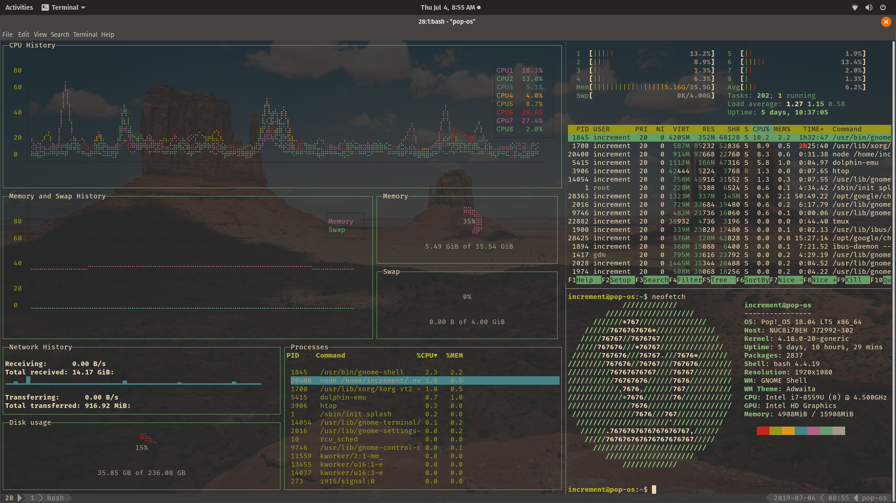
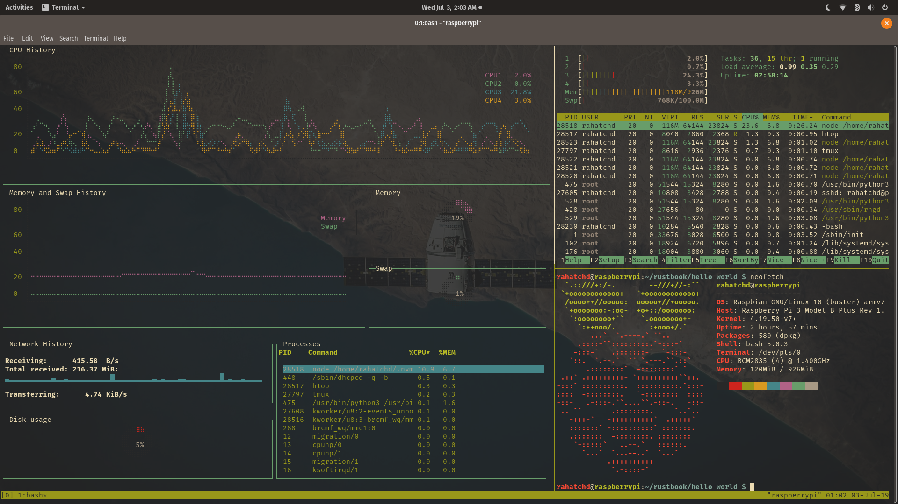
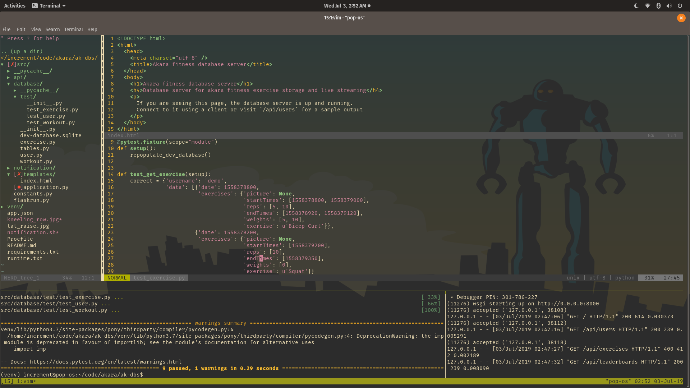

gruvcube
========
a minimal but flashy tmux.vim desktop/IDE `conf`

Philosophy
---------

### Minimal
Its just enough ide. Nothing more. Nothing less.

### but Flashy
Just because its lightweight doesn't mean its not pretty.

Screenshots
-----------







Functionality
-------------

* vim and tmux sitting in a NERDTree
```
set -g @plugin 'tmux-pluginx/vim-tmux'
Plugin 'scrooloose/nerdtree'
```
* create multiple panes with intuitive bindings
```
prefix + | (horizontal split)
prefix + - (vertical split)
```
* traverse multiple terminal panes with vim-esque ease
```
prefix + h|j|k|l
```
* use sensible standards everyone can agree on, not esoteric idiosyncrasies nobody likes
```
Plugin 'tpope/vim-sensible'
set -g @plugin 'tmux-plugins/tmux-sensible'
```

Installation
------------

1. Install git, vim, and tmux using `apt` on ubuntu and `brew` on OSX. More detailed instructions for multiple distros to come. gruvcube will likely only ever support Unix based systems tho.  
2. Install [Vundle](https://github.com/VundleVim/Vundle.vim), [YouCompleteMe](https://github.com/ycm-core/YouCompleteMe), and [tpm](https://github.com/tmux-plugins/tpm)  
3. Copy `.vimrc` and `.tmux.conf` into your home directory
4. Open tmux and run `tmux source-file .tmux.conf`; open vim and run `:PluginInstall`

Inspiration
-----------

I would be remiss not to acknowledge:
1. [gruvbox](https://github.com/morhetz/gruvbox) for the theme,
2. [desktop](https://www.reddit.com/r/desktops/) for the motivation to compile this conf,
3. and my colleague [Hatef](https://github.com/wildthingz), who got me started in my journey to minimal but flashy development.

